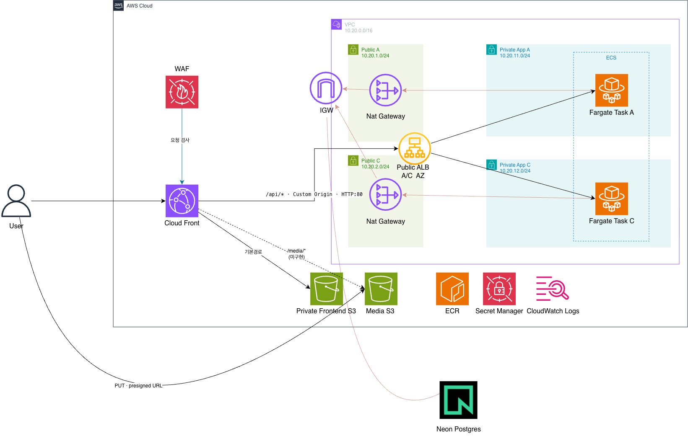

# Velocity Bulletin Infrastructure

Velocity Bulletin의 AWS 인프라 설계와 운영 기준을 정의합니다.

백엔드 저장소:

- [Backend](https://github.com/m161awm2/velocity-bulletinBE)

## 목표

- 서울 리전(`ap-northeast-2`)의 2개 가용 영역에 운영 워크로드를 분산합니다.
- 프런트엔드, API, 사용자 업로드 파일의 origin을 외부에 직접 노출하지 않습니다.
- 사람은 AWS IAM Identity Center(SSO), CI/CD는 GitHub OIDC, 워크로드는 IAM Role로 인증합니다.
- 단일 AZ 장애 시 서비스를 계속 제공할 수 있어야 합니다.
- 월 AWS 비용은 Neon 비용과 세금을 제외하고 약 20만~25만 원을 초기 운영 범위로 봅니다.
- 불필요한 상시 관리 서버와 장기 Access Key를 만들지 않습니다.

## 다이어그램



- VPC `10.20.0.0/16`, 2개 AZ, 각 AZ에 Public / Private App 서브넷.
- Public 서브넷은 NAT Gateway 전용이며 워크로드를 두지 않습니다.
- ECS Fargate 백엔드는 Private App 서브넷 2곳에 분산되고 Public IP가 없습니다.
- `/*` 요청은 CloudFront → private frontend S3(OAC)로, `/api/*` 요청은 캐시 없이 CloudFront → internal ALB로 전달됩니다.
- internal ALB는 외부에서 직접 접근할 수 없고, CloudFront VPC Origin을 통해서만 도달합니다.

## 트러블슈팅
[이동하기](./Troubleshootings.md)

## 구축 순서

실제로 AWS 콘솔에서 이 순서대로 만들었습니다. Terraform 파일들은 이 순서를 그대로 코드로 옮긴 것입니다.

1. **네트워크**: VPC `10.20.0.0/16`, 서브넷 4개(Public A/C `10.20.1.0/24` `10.20.2.0/24`, Private App A/C `10.20.11.0/24` `10.20.12.0/24`), IGW와 NAT Gateway를 라우팅 테이블에 연결.
2. **ECS 클러스터**(Fargate) 생성.
3. **ECR 레포지토리** 생성, 로컬에서 이미지 push.
4. **IAM 역할 2개** 생성
   - `velocity-task-execution-role` (사용 사례: ECS → ECS Task) — `AmazonECSTaskExecutionRolePolicy` 부착
   - `velocity-task-role` — 처음엔 정책 없이 생성, 이후 S3 업로드용 인라인 정책 추가
5. **S3 미디어 버킷** `velocity-media-608420805531` 생성 후, `velocity-task-role`에 다음 인라인 정책 부착:
   ```json
   {
     "Version": "2012-10-17",
     "Statement": [
       { "Effect": "Allow", "Action": "s3:PutObject", "Resource": "arn:aws:s3:::velocity-media-608420805531/media/*" }
     ]
   }
   ```
6. **Secrets Manager**: `openssl rand -hex 32`로 JWT 서명용 랜덤 값 생성, DB 연결 문자열과 함께 하나의 Secret에 `DATABASE_URL` / `JWT_SECRET` 키로 저장. `velocity-task-execution-role`에 해당 Secret ARN으로 범위를 좁힌 `secretsmanager:GetSecretValue` 정책 부착 (ECS가 컨테이너 시작 시 Secret을 읽어 환경변수로 주입하므로 Execution Role 권한).
7. **ECS 태스크 정의**: 환경변수 2개를 값유형 `ValueFrom`으로 지정
   - `DATABASE_URL` → `arn:...:secret:velocitySecretManager-wBaiFO:DATABASE_URL::`
   - `JWT_SECRET` → `arn:...:secret:velocitySecretManager-wBaiFO:JWT_SECRET::`
8. **마이그레이션용 Secret**을 하나 더 생성 — Neon의 커넥션 풀링을 끈(unpooled/direct) URL. 마이그레이션 태스크는 여러 요청이 커넥션을 나눠 쓸 필요가 없으므로 풀링이 필요 없습니다.
9. **마이그레이션 실행**: ECS 클러스터에서 프라이빗 서브넷 1개에 일회성 태스크 실행, 컨테이너 재정의로 `/app/migrate -action up` 실행. 로그에 `migration complete`가 뜨면 종료.
10. **타겟 그룹**: target type `ip`, health check path `/health/ready`.
11. **보안 그룹 2개**
    - ALB SG: 만들기만 하고 규칙은 나중에(9번 CloudFront VPC Origin 생성 이후) 추가
    - Task SG: 인바운드 TCP `8080`, 소스는 ALB SG
12. **internal ALB** 생성 — internal, 두 가용영역의 Private App 서브넷, 위 타겟 그룹 대상.
13. **ECS 서비스** 생성 — 태스크 2개 유지, Private 서브넷 2곳, Public IP 끔, Task SG 적용, 타겟 그룹에 자동 등록. 이 시점에 타겟 그룹에 healthy 타겟 2개가 뜹니다.
14. **CloudFront VPC Origin**: ALB SG 인바운드에 `com.amazonaws.global.cloudfront.origin-facing` prefix list로 80 포트 허용 → CloudFront에서 VPC Origin(`velocity-api-origin`, 프로토콜 HTTP-only, 대상 internal ALB ARN) 생성 → 배포되면 AWS가 자동으로 만드는 관리형 보안 그룹을 internal ALB SG의 인바운드 허용 목록에 추가.
15. **프런트엔드**: 정적 사이트용 S3 버킷 생성, `npm ci && npm run build`로 빌드한 정적 파일을 버킷에 업로드.

여기까지가 "백엔드는 어느 정도 완성"된 상태였고, 14번 CloudFront 연결 단계에서 위 "실제로 있었던 일: 인터널 ALB + CloudFront VPC Origin" 절에 적은 문제가 발생했습니다.

### 나중에 발견한 것: 비-시크릿 환경변수 누락

7번에서 `DATABASE_URL`, `JWT_SECRET`은 Secrets Manager `valueFrom`으로 넣었지만, 그 둘 말고 일반(평문) `environment` 항목은 태스크 정의에 하나도 없었습니다. 그 결과:

- `APP_ENV`가 없어서 앱이 기본값인 `development`로 떠서 Gin이 debug 모드로 실행됨
- `S3_BUCKET`이 없어서 `UploadsEnabled()`가 `false`가 되어 5번에서 만든 미디어 버킷/IAM 권한이 있는데도 업로드 기능이 꺼져 있었음

`/health/ready`가 Neon DB에 실제로 ping하는 핸들러라 200이 계속 떠서 DB 연결 자체는 정상이었지만, 이 두 값은 별개로 빠져 있었던 것 — 태스크 정의에 `environment`로 `APP_ENV=production`, `S3_BUCKET=velocity-media-608420805531`를 추가한 새 리비전을 배포해서 해결했습니다. `S3_PUBLIC_BASE_URL`은 아직 미디어를 공개로 서빙할 CloudFront 배포/OAC가 없어서 의도적으로 비워뒀습니다 (지금 값을 넣어도 실제로 접근 가능한 URL이 아님).

## Terraform

루트에 있는 `.tf` 파일들이 위 "구축 순서" 1~14번(마이그레이션 실행 제외 — 아래 참고)을 코드화한 것입니다.

| 파일 | 내용 |
| --- | --- |
| `network.tf` | VPC, 서브넷 4개, IGW, AZ별 NAT Gateway, 라우팅 테이블, S3 Gateway Endpoint |
| `ecr.tf` | ECR 리포지토리, lifecycle 정책 |
| `iam.tf` | `velocity-task-execution-role`, `velocity-task-role`과 각각의 정책 |
| `s3.tf` | 미디어 버킷, 프런트엔드 버킷(OAC 전용) |
| `secrets.tf` | 앱 런타임 Secret(`DATABASE_URL`, `JWT_SECRET`), 마이그레이션 Secret |
| `alb.tf` | ALB SG, Task SG, 타겟 그룹, internal ALB, 리스너 |
| `ecs.tf` | ECS 클러스터, 백엔드 태스크 정의, 마이그레이션 태스크 정의, ECS 서비스 |
| `cloudfront.tf` | OAC, CloudFront VPC Origin, origin request policy, 배포(default `/*` + `/api/*` behavior) |
| `outputs.tf` | ALB DNS, CloudFront 도메인, ECR URL 등 |

### 알려진 부트스트랩 순서 문제

`alb.tf`의 ALB 보안 그룹 인바운드 규칙은 CloudFront VPC Origin이 배포에 연결된 **이후에** AWS가 자동 생성하는 관리형 보안 그룹 ID가 있어야 만들 수 있습니다. 콘솔에서 겪은 것과 같은 순서 문제이므로 2단계로 적용합니다.

```bash
terraform apply                                        # 1단계: 이 규칙만 빼고 전부 생성
# AWS 콘솔 또는 aws ec2 describe-security-groups 로 VPC Origin 관리형 SG ID 확인
terraform apply -var="cloudfront_vpc_origin_managed_sg_id=sg-xxxxxxxxxxxxxxxxx"  # 2단계
```

### 마이그레이션 태스크

`aws_ecs_task_definition.migrate`는 정의만 Terraform으로 관리하고, 실행은 일회성이라 Terraform 리소스로 만들지 않았습니다. 배포할 때마다 다음처럼 수동/CI로 실행합니다.

```bash
aws ecs run-task \
  --cluster velocity-cluster \
  --task-definition velocity-migrate \
  --launch-type FARGATE \
  --network-configuration "awsvpcConfiguration={subnets=[<프라이빗 서브넷 1개>],securityGroups=[<task sg>],assignPublicIp=DISABLED}" \
  --overrides '{"containerOverrides":[{"name":"Migrate","command":["/app/migrate","-action","up"]}]}'
```

로그 그룹 `/ecs/velocity-migrate`에서 `migration complete`를 확인한 뒤 서비스 배포로 넘어갑니다.

### 사용법

```bash
terraform init
cp example.tfvars terraform.tfvars   # database_url, migration_database_url 채우기 (커밋 금지)
terraform plan  -var-file=terraform.tfvars
terraform apply -var-file=terraform.tfvars
```

`backend_image`는 로컬에서 채우거나, CI에서 `-var="backend_image=<ecr_repo_url>:<git-sha>"`로 매 배포마다 넘깁니다.

시크릿(`database_url`, `migration_database_url`)은 `terraform.tfvars`(gitignore 처리됨), `TF_VAR_*` 환경변수, 또는 CI의 `-var`로만 주입하고 저장소에는 절대 커밋하지 않습니다.
