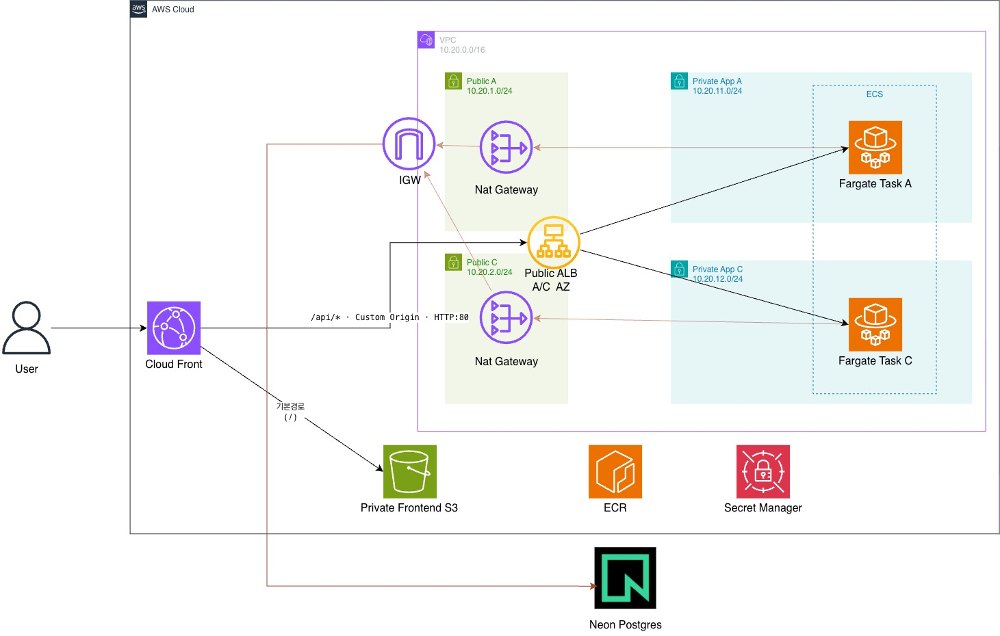

# Velocity Bulletin Infrastructure

[ECS Fargate 구축 기록](https://velog.io/@m161awm/AWS-Build-Chall-ECS-%ED%8C%8C%EA%B2%8C%EC%9D%B4%ED%8A%B8%EB%A5%BC-%EC%82%AC%EC%9A%A9%ED%95%9C-%EC%9B%B9-%EC%84%9C%EB%B9%84%EC%8A%A4%EA%B0%80-%EB%8F%8C%EC%95%84%EA%B0%88-%ED%99%98%EA%B2%BD%EC%9D%84-%EA%B5%AC%EC%B6%95%ED%95%B4%EB%B3%B4%EC%9E%90)에 맞춘 AWS 인프라 Terraform 코드입니다.

## 구성

- CloudFront가 기본 경로를 비공개 프론트엔드 S3로, `/api/*`를 ALB로 전달합니다. API 캐시는 끕니다.
- 퍼블릭 ALB는 CloudFront origin-facing 주소와 배포별 검증 헤더를 모두 확인하고, ECS Fargate 태스크는 프라이빗 서브넷에서 퍼블릭 IP 없이 실행합니다.
- 두 AZ의 프라이빗 서브넷은 NAT Gateway 하나와 공용 라우팅 테이블을 사용합니다.
- DB 연결 정보는 Secrets Manager에서 주입합니다. 애플리케이션 태스크 역할에는 별도 AWS 권한을 주지 않습니다.
- WAF는 별도 비용 때문에 포함하지 않았습니다.
### 다이어그램


## 실행

먼저 `example.tfvars`를 `terraform.tfvars`로 복사해 `database_url`, `backend_image`를 채운 뒤 실행합니다. `database_url`에는 Neon pooled URL을 사용하며, 웹서비스와 마이그레이션 태스크가 같은 주소를 사용합니다. 실제 DB 자격 증명은 저장소에 커밋하지 않습니다.

```sh
cp example.tfvars terraform.tfvars
terraform init
terraform plan -var-file=terraform.tfvars
terraform apply -var-file=terraform.tfvars
```

실제 배포 전 ECS에서 일회성 마이그레이션 태스크를 실행합니다.
